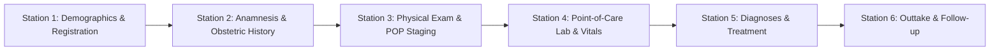
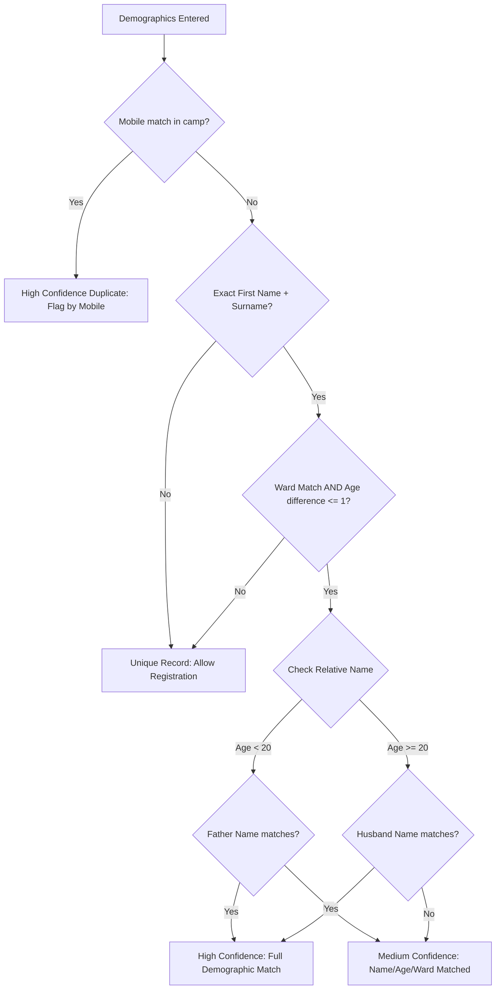

# Gynocamp Patient Registration System
## Clinical Data Dictionary: 2-Page Yellow Intake Form

**Document Version:** 1.0  
**Phase:** 2 — Clinical Yellow Form Digitization & Intake Engine  
**Fidelity Reference:** `yellow form_2026_12pt (1).pdf`  
**Classification:** Medical Device Software Specification (SaMD - Class B)

---

### 1. Overview & Station Architecture

The Gynocamp paper clinical intake form ("Yellow Form", 2 pages) is digitized into an intuitive, high-throughput **6-Station Stepper Workflow** optimized for field tablets and mobile touchscreens in remote rural camps without internet access.

Each station operates independently, validating clinical parameters in real time and writing encrypted records to the local SQLite database (`tablePatients` and `tableClinicalVisits`).

---

### 2. Station 1: Patient Demographics & Registration (Page 1 Top)

| Field Name | Type | SQLite Column | Mandatory | Validation / Rules | Nepali Translation |
| :--- | :--- | :--- | :---: | :--- | :--- |
| **Patient ID** | String | `patient_id` | Yes (Auto) | Format: `GC-[CampCode]-[Year]-[Seq5]` (e.g. `GC-KTM01-2026-00001`) | बिरामी नम्बर |
| **Camp ID** | String | `camp_id` | Yes | Foreign Key referencing `camps(id)` | शिविर नम्बर |
| **Intake Date** | ISO Date | `intake_date` | Yes | Default: Today. Stored ISO8601, displayed dual calendar (AD + BS) | दर्ता मिति |
| **First Name** | String | `first_name` | Yes | Min 1 char, trimmed, sanitized | नाम |
| **Surname** | String | `surname` | Yes | Min 1 char, trimmed, sanitized | थर |
| **Age** | Integer | `age` | Yes | Range: 10 – 110. Controls relationship field logic | उमेर |
| **Relative Name** | String | `spouse_or_father_name` | Conditional | Father's name if Age < 20; Husband's name if Age ≥ 20 | श्रीमानको / बुबाको नाम |
| **Relationship** | Enum | `relationship_type` | Yes | `Husband`, `Father`, `Guardian`, `M/SM/GP` | नाता |
| **Mobile Number** | String | `mobile` | Optional | 10 digits (`98XXXXXXXX` / `97XXXXXXXX`). Primary duplicate index | मोबाइल नम्बर |
| **District** | String | `district` | Yes | Default: Camp's district | जिल्ला |
| **Municipality** | String | `municipality` | Yes | Local municipality / Gaunpalika | नगरपालिका / गाउँपालिका |
| **Ward Number** | String | `ward` | Yes | Range: 01 – 35. Required for duplicate detection | वडा नं |
| **Marital Status** | Enum | `marital_status` | Yes | `married`, `widow`, `unmarried`, `divorced` | वैवाहिक स्थिति |
| **Marital Age** | Integer | `marital_age` | Optional | Age at first marriage | विवाह हुँदाको उमेर |
| **Reasons for Visit** | String List | `reasons_for_visit` | Optional | Multi-select checkboxes from 8 standard complaint types | शिविरमा आउनुको मुख्य कारण |
| **Consent Treatment** | Boolean | `consent_treatment` | Yes | Default: 1 (True). Mandatory clinical consent | उपचार सहमति |
| **Consent Data Store** | Boolean | `consent_store_medical_info` | Yes | Default: 1 (True). Compliance consent | तथ्यांक भण्डारण सहमति |

#### 2.1 Eight Standard Reasons for Visit (Page 1 Checkboxes)
1. **Something hanging out / Prolapse** (`पाठेघर खस्ने समस्या`)
2. **Discharge and/or itching** (`योनीबाट पानी बग्ने वा चिलाउने`)
3. **Problems passing urine / Incontinence** (`पिसाब फेर्न समस्या / चुहिने`)
4. **Problems passing stool** (`दिसा गर्न समस्या`)
5. **Menstrual problem** (`महिनावारी सम्बन्धी समस्या`)
6. **Infertility** (`बाँझोपन`)
7. **Abdominal / Back pain** (`तल्लो पेट वा ढाड दुख्ने`)
8. **General Checkup** (`नियमित स्वास्थ्य जाँच`)

---

### 3. Station 2: Anamnesis & Obstetric History (Page 1 Body)

| Field Name | Type | SQLite Column | Constraints & Rules |
| :--- | :--- | :--- | :--- |
| **Deliveries (Parity)** | Integer | `deliveries` | Range: 0 – 20. Total births |
| **Living Children** | Integer | `living_children` | Rule: `living_children <= deliveries`. Hard error if violated. |
| **Abortions / Miscarriages** | Integer | `abortions` | Range: 0 – 15 |
| **Structured Complaints** | JSON Map | `anamnesis_complaints` | Duration (`<1m`, `1-6m`, `6-12m`, `>1y`), details, and remarks |

---

### 4. Station 3: Physical Examination & POP Staging (Page 2 Top)

| Field Name | Type | SQLite Column | Values / Range | Description |
| :--- | :--- | :--- | :--- | :--- |
| **Uterus Inside** | Boolean | `uterus_inside` | `0` (Out / Prolapsed), `1` (Inside) | General inspection finding |
| **Pelvic Floor Tone** | Enum | `pelvic_floor_tone` | `normal`, `weak`, `hypertonic` | Manual palpation / Kegel assessment |
| **POP Anterior Stage** | Integer | `pop_anterior_stage` | `0, 1, 2, 3` | Cystocele / anterior vaginal wall |
| **POP Middle Stage** | Integer | `pop_middle_stage` | `0, 1, 2, 3, 4` | Uterocervical descent / apex prolapse |
| **POP Posterior Stage**| Integer | `pop_posterior_stage` | `0, 1, 2, 3` | Rectocele / posterior vaginal wall |
| **Highest POP Stage** | Integer | `highest_pop_stage` | `0, 1, 2, 3, 4` | **Auto-computed:** $\max(\text{anterior}, \text{middle}, \text{posterior})$ |

#### 4.1 Automated POP Staging Logic
The software automatically calculates and records the primary overall Pelvic Organ Prolapse stage based on standard simplified Baden-Walker / POP-Q staging:
$$\text{Highest POP Stage} = \max(\text{popAnterior}, \text{popMiddle}, \text{popPosterior})$$

---

### 5. Station 4: Point-of-Care Lab Tests & Numeric Vitals (Page 2 Middle)

| Parameter | Unit | Normal Range | Soft Warning Alert | Hard Error (Block) | Clinical Rationale |
| :--- | :---: | :---: | :---: | :---: | :--- |
| **Urine Test** | Categorical | `normal` | `pos` (Infection) | N/A | Rapid dipstick for leukocyte / nitrite |
| **Pregnancy Test**| Categorical| `neg` | `pos` (Pregnant) | N/A | Rapid hCG strip |
| **Systolic BP** | mmHg | 90 – 160 | $<90$ or $>160$ | $<60$ or $>260$ | Prevents typos; alerts on hypertension |
| **Diastolic BP** | mmHg | 60 – 100 | $<60$ or $>100$ | $<40$ or $>160$ | Enforces $\text{Diastolic} < \text{Systolic}$ |
| **Pulse Rate** | bpm | 55 – 110 | $<55$ or $>110$ | $<35$ or $>220$ | Alerts on bradycardia / tachycardia |
| **SpO2** | % | 92 – 100 | $<92$ (Hypoxia) | $<50$ or $>100$ | Pulse oximetry physiological bounds |
| **Blood Glucose**| mg/dL | 70 – 200 | $<70$ or $>200$ | $<30$ or $>600$ | Random capillary blood glucose |

---

### 6. Station 5: Standard Diagnoses & Treatment (Page 2 Middle & Bottom)

#### 6.1 The 21 Standard Diagnoses (Yellow Form Official Master List)

| # | Diagnosis Name | Nepali Script Translation | ICD-10 Ref | Common Treatment Protocol |
| :-: | :--- | :--- | :---: | :--- |
| 1 | **atrophy vagina** | योनी सुख्खा हुने (Atrophic Vaginitis) | N95.2 | Topical estrogen cream / lubricant |
| 2 | **bacterial vaginosis** | ब्याक्टेरियल संक्रमण (BV) | N76.0 | Metronidazole 400mg PO BD |
| 3 | **candid infection** | ढुसी संक्रमण (Candidiasis) | B37.3 | Fluconazole 150mg PO stat |
| 4 | **trichomonas** | ट्राइकोमोनियासिस परजीवी संक्रमण | A59.0 | Metronidazole 2g single dose |
| 5 | **PID** | तल्लो पेटको भित्री संक्रमण (PID) | N73.9 | Doxycycline + Metronidazole |
| 6 | **cervicitis** | पाठेघरको मुख सुन्निने (Cervicitis) | N72 | Cefixime + Azithromycin |
| 7 | **cervical polyp** | पाठेघरको मुखमा मासु पलाएको | N84.0 | Polypectomy referral |
| 8 | **cervical carcinoma** | पाठेघरको मुखको क्यान्सर | C53 | Urgent Tertiary Oncology referral |
| 9 | **condylomata** | यौनाङ्गको मुसा (Genital Warts) | A63.0 | Podophyllin / Cryotherapy |
| 10 | **fistula** | फिस्टुला (VVF / RVF) | N82.0 | Surgical repair referral |
| 11 | **infertility** | निसन्तानपन (बाँझोपन) | N97.9 | Hormonal profile / HSG referral |
| 12 | **myoma** | पाठेघरको ट्युमर (Fibroid) | D25.9 | USG confirmation / myomectomy |
| 13 | **cystitis** | मूत्राशयको संक्रमण (UTI) | N30.0 | Ciprofloxacin 500mg BD x 5d |
| 14 | **lichen sclerosis** | योनीको कडा सेतो दाग समस्या | L90.0 | High-potency corticosteroid ointment |
| 15 | **stress incontinence** | खोक्दा वा हाँस्दा पिसाब चुहिने | N39.3 | Pelvic floor muscle therapy (Kegel) |
| 16 | **urge incontinence** | पिसाब थाम्न नसक्ने समस्या | N39.41 | Bladder training / Anticholinergics |
| 17 | **POP** | आङ खस्ने समस्या (Prolapse) | N81.9 | Ring Pessary / Surgical repair |
| 18 | **anal incontinence** | दिसा थाम्न नसक्ने समस्या | R15 | Sphincter evaluation / dietary advice |
| 19 | **prolapse recti** | मलद्वार बाहिर निस्कने समस्या | K62.3 | Surgical referral |
| 20 | **hypertension** | उच्च रक्तचाप (High BP) | I10 | Amlodipine 5mg / referral |
| 21 | **diabetes mellitus** | मधुमेह (चिनी रोग) | E11 | Metformin 500mg / dietary counseling|

#### 6.2 The 10 Standard Prescribed Medications

| # | Medication Name | Formulation | Standard Camp Dispensing |
| :-: | :--- | :--- | :--- |
| 1 | **Metronidazole** | 400 mg Tab | 1 tab PO BD x 7 days |
| 2 | **Ciprofloxacin** | 500 mg Tab | 1 tab PO BD x 5 days |
| 3 | **Fluconazole** | 150 mg Tab | 1 tab PO single stat dose |
| 4 | **Doxycycline** | 100 mg Cap | 1 cap PO BD x 14 days |
| 5 | **Clotrimazole** | 100 mg Vag Tab | 1 tab PV at bedtime x 6 nights |
| 6 | **Ibuprofen / Paracetamol** | 400 / 500 mg Tab | PRN for pelvic/back ache |
| 7 | **Iron with Folic Acid** | 60 mg Iron / 400 mcg FA | 1 tab PO OD x 30 days |
| 8 | **Calcium with Vitamin D3**| 500 mg / 250 IU | 1 tab PO OD x 30 days |
| 9 | **Amlodipine** | 5 mg Tab | 1 tab PO OD (Hypertension) |
| 10 | **Metformin** | 500 mg Tab | 1 tab PO OD/BD (Diabetes) |

#### 6.3 Ring Pessary & Surgical Referral Options
- **Pessary Types:** `ring`, `ring with support`, `ring with knob`
- **Pessary Sizes:** Standard mm diameters (`55mm`, `60mm`, `65mm`, `70mm`, `75mm`, `80mm`, `85mm`)
- **Designated Referral Hospitals:**
  - `Scheer Memorial Hospital (Banepa)`
  - `Kathmandu Model Hospital`
  - `Dhulikhel Hospital`
  - `Patan Hospital`
  - `Local Government District Hospital`

---

### 7. Station 6: Outtake & Follow-Up (Page 2 Bottom)

| Field Name | Type | SQLite Column | Options / Values |
| :--- | :--- | :--- | :--- |
| **Follow-up Needed** | Boolean | `follow_up_needed` | `true`, `false` |
| **Follow-up Center** | Enum | `follow_up_destination` | `Health Post` (Local Health Post), `GynaeSupport Nurse` |
| **Clinical Notes** | String | `outtake_notes` | Free-text clinical summary, dietary instructions, or surgical triage notes |

---

### 8. Duplicate Detection Engine Specification

To eliminate repeated registrations during crowded camps, the system executes real-time 5-point deduplication against the local SQLite store as staff enter demographic details.

---

### 9. Verification & Audit Trail Compliance

Every save operation at Station 1 or Station 6 commits:
1. An encrypted SQLite record with ISO8601 timestamps and device UUID.
2. An incremental update to the active camp's `total_patients_registered`.
3. A SHA-256 chained audit log entry (`PATIENT_REGISTER` or `CLINICAL_ENTRY`) preserving the staff user ID and hardware signature.
