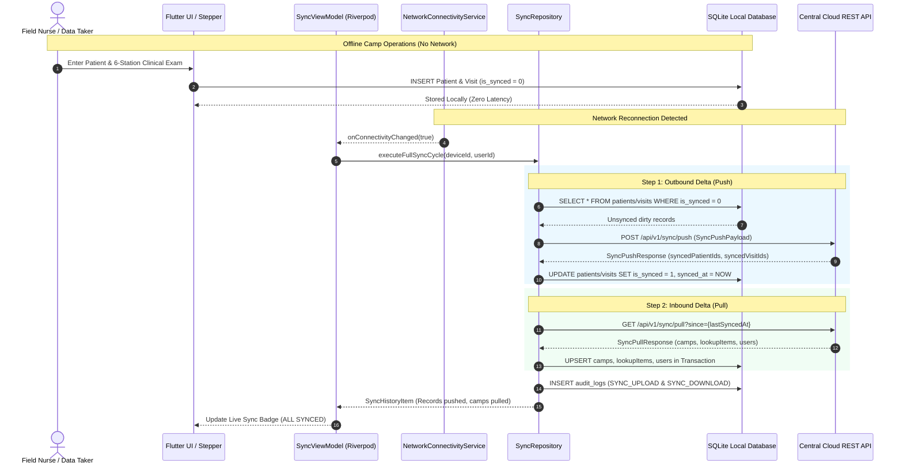
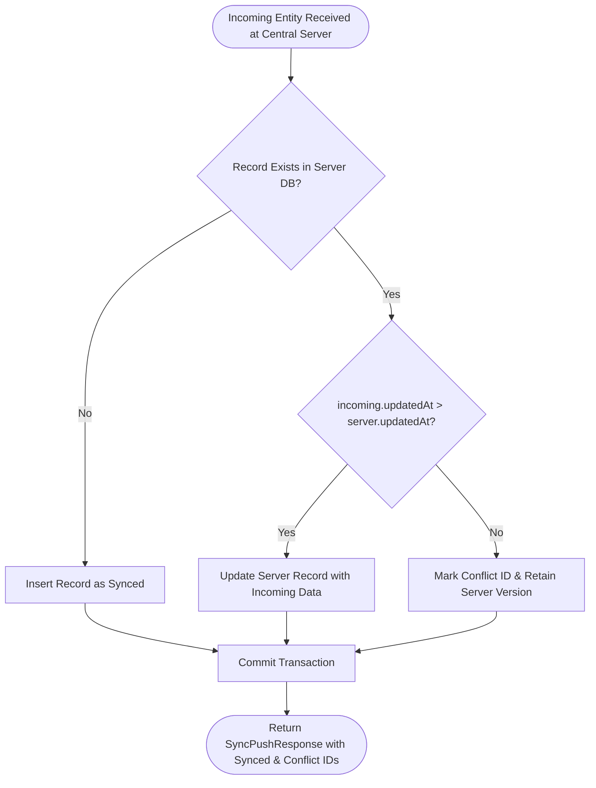

# Gynocamp Patient Registration System
## System Architecture & Offline Two-Way Auto-Sync Engine

**Document Version:** 1.0  
**Phase:** 3 — Offline Data Storage & Two-Way Auto-Sync Engine  
**Standard:** HL7 FHIR-aligned / ISO 27799 / IEC 62304 Class B  
**Target Deployment:** Remote Rural Health Camps (Himalayan / Terai Districts of Nepal)

---

### 1. Executive Architecture Summary

In remote field camps across rural Nepal, mobile network connectivity is intermittent, low-bandwidth, or completely non-existent for multiple days. The Gynocamp Patient Registration System is architected under a strict **Local-First, Zero-Data-Loss Guarantee**:

1. **Primary Data Store**: Embedded SQLite (`sqflite_common_ffi` / SQLite 3) residing entirely on the local field tablet or mobile handset. All reads, queries, and writes occur synchronously against SQLite with zero latency and zero reliance on network availability.
2. **Deterministic Status Tracking**: Every patient record (`patients`), clinical visit (`clinical_visits`), and audit log (`audit_logs`) maintains boolean flags `is_synced INTEGER DEFAULT 0` and timestamp `synced_at TEXT`.
3. **Reactive Reconnection Trigger**: Network connectivity is monitored continuously via `NetworkConnectivityService`. The instant cellular data (2G/3G/4G) or Wi-Fi becomes available, a background auto-sync cycle is triggered without interrupting ongoing clinical data intake.
4. **Two-Way Delta Synchronization**:
   - **Outbound (Push Delta)**: Collects newly registered patients and clinical visits where `is_synced = 0`, bundles them into a compact JSON payload, uploads to the central cloud server, and flips `is_synced = 1` atomically inside a local SQLite transaction.
   - **Inbound (Pull Delta)**: Requests camps, lookup items (symptoms, diagnoses, medications), and staff credentials updated since `last_synced_at`. Merges cloud updates into local SQLite using atomic upserts (`ConflictAlgorithm.replace`).
5. **Conflict Resolution**: Last-Write-Wins (LWW) resolution based on UTC timestamps (`updatedAt ?? createdAt`), preventing stale overwrite when multiple field workers or administrators edit records.

---

### 2. Architectural Data Flow & Component Topology



---

### 3. Data Contracts & JSON Payloads

#### 3.1 Outbound Push Payload (`POST /api/v1/sync/push`)

```json
{
  "device_id": "TAB-KTM-001",
  "generated_at": "2026-09-06T06:30:00.000Z",
  "patients": [
    {
      "id": "c85d852a-9e12-4091-a15d-8b010c30a442",
      "patient_id": "GC-KTM01-2026-00042",
      "camp_id": "camp-ktm-01",
      "camp_code": "KTM01",
      "intake_date": "2026-03-15T00:00:00.000Z",
      "first_name": "Sunita",
      "surname": "Shrestha",
      "age": 34,
      "spouse_or_father_name": "Bikash Shrestha",
      "relationship_type": "Husband",
      "mobile": "9841234567",
      "ward": "03",
      "marital_status": "married",
      "reasons_for_visit": ["Lower abdominal pain", "White discharge"],
      "created_by_user_id": "usr-datataker-01",
      "created_by_device_id": "TAB-KTM-001",
      "created_at": "2026-03-15T09:12:00.000Z",
      "updated_at": "2026-03-15T09:20:00.000Z"
    }
  ],
  "clinical_visits": [
    {
      "id": "e44d320a-81a1-4eb2-a1f9-86f7b1922c01",
      "patient_id": "GC-KTM01-2026-00042",
      "camp_id": "camp-ktm-01",
      "visit_date": "2026-03-15T00:00:00.000Z",
      "deliveries": 3,
      "living_children": 3,
      "abortions": 0,
      "uterus_inside": true,
      "pelvic_floor_tone": "normal",
      "pop_anterior_stage": 1,
      "pop_middle_stage": 0,
      "pop_posterior_stage": 0,
      "highest_pop_stage": 1,
      "systolic_bp": 120,
      "diastolic_bp": 80,
      "pulse": 72,
      "spo2": 98,
      "glucose": 95,
      "diagnoses": ["PID", "POP Stage 1"],
      "medications": ["Ciprofloxacin 500mg", "Metronidazole 400mg"],
      "created_by_user_id": "usr-datataker-01",
      "created_at": "2026-03-15T09:15:00.000Z"
    }
  ],
  "audit_logs": []
}
```

#### 3.2 Outbound Push Response

```json
{
  "success": true,
  "server_timestamp": "2026-09-06T06:30:02.150Z",
  "synced_patient_ids": ["c85d852a-9e12-4091-a15d-8b010c30a442"],
  "synced_visit_ids": ["e44d320a-81a1-4eb2-a1f9-86f7b1922c01"],
  "synced_audit_log_ids": [],
  "conflict_entity_ids": [],
  "message": "Successfully processed 1 patients and 1 visits."
}
```

#### 3.3 Inbound Pull Response (`GET /api/v1/sync/pull?since={ISO}&device_id={ID}`)

```json
{
  "success": true,
  "server_timestamp": "2026-09-06T06:30:03.000Z",
  "camps": [
    {
      "id": "camp-ktm-01",
      "camp_code": "KTM01",
      "name": "Kathmandu Community Gyno Health Camp",
      "district": "Kathmandu",
      "municipality": "Budhanilkantha Municipality",
      "ward": "03",
      "venue": "Primary Health Care Center",
      "status": "open",
      "start_date": "2026-03-14T00:00:00.000Z",
      "end_date": "2026-03-18T00:00:00.000Z"
    }
  ],
  "lookup_items": [],
  "users": [],
  "message": "Pulled 1 camps, 0 users."
}
```

---

### 4. Conflict Resolution: Last-Write-Wins (LWW)



- If `incomingTime >= serverTime`: the newer client delta updates the server.
- If `incomingTime < serverTime`: the server delta is newer; the incoming payload entity ID is flagged as a conflict, retaining the central version.

---

### 5. Security & Tamper-Evident Sync Auditing

Every push and pull cycle writes cryptographic entries to the tamper-evident audit log table (`tableAuditLogs`):
1. **Upload Action**: `SYNC_UPLOAD` containing `patientsPushed` and `visitsPushed` counts, associated with `deviceId` and `userId`.
2. **Download Action**: `SYNC_DOWNLOAD` containing `campsPulled` and `lookupItemsPulled` counts.
3. **Chained SHA-256 Signature**: The audit log verifies that records pushed cannot be repudiated or tampered with retrospectively.

---

### 6. Field Testing Simulation Utilities

To facilitate training, deployment readiness drills, and network fault tolerance tests:
- **Connection Toggle**: The UI features an interactive **Online / Offline Simulation Switch** in `SyncStatusView`.
- **Manual Sync Override**: "Synchronize Now (अहिले सिंक गर्नुहोस्)" allows staff to trigger immediate push/pull before packing camp equipment.
- **Visual Status Badging**:
  - `Online`: Vibrant Emerald Green badge (`#10B981`) with Wi-Fi icon.
  - `Offline`: Amber Warning badge (`#F59E0B`) with Wi-Fi Off icon and persistent notification that records are securely protected in local SQLite memory.
