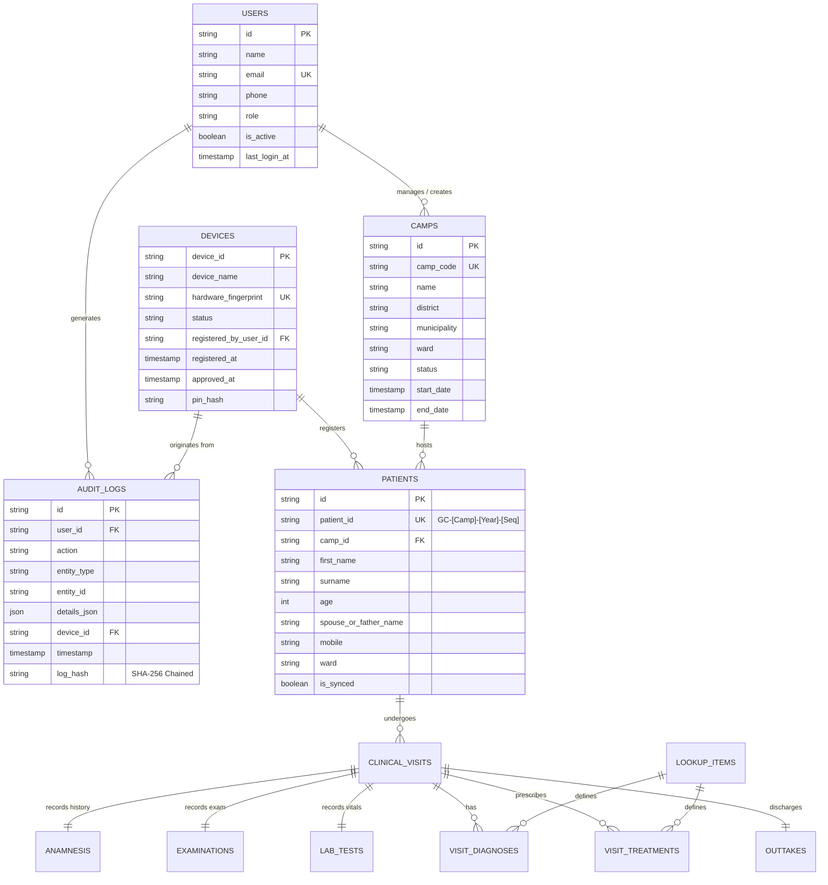

# Database Schema & Entity Relationship Design (ERD)
## Central Cloud (PostgreSQL) & Field Mobile (SQLite) Schemas

---

## 1. Entity Relationship Diagram (ERD)



---

## 2. Core Relational Tables Specification

### 2.1 Table: `users`
Stores user credentials, contact details, and role assignments.
```sql
CREATE TABLE users (
    id VARCHAR(36) PRIMARY KEY,
    name VARCHAR(150) NOT NULL,
    email VARCHAR(255) UNIQUE NOT NULL,
    phone VARCHAR(20),
    role VARCHAR(30) NOT NULL CHECK (role IN ('SUPER_ADMIN', 'DATA_TAKER', 'DATA_ANALYST')),
    is_active BOOLEAN NOT NULL DEFAULT TRUE,
    last_login_at TIMESTAMP WITH TIME ZONE,
    assigned_camp_ids TEXT, -- Comma-separated or JSON array of camp IDs
    created_at TIMESTAMP WITH TIME ZONE DEFAULT NOW()
);
```

### 2.2 Table: `devices`
Manages hardware authorization, OTP activation state, and local PIN protection.
```sql
CREATE TABLE devices (
    device_id VARCHAR(36) PRIMARY KEY,
    device_name VARCHAR(100) NOT NULL,
    model VARCHAR(100),
    hardware_fingerprint VARCHAR(64) UNIQUE NOT NULL,
    status VARCHAR(30) NOT NULL CHECK (status IN ('UNREGISTERED', 'PENDING_OTP', 'PENDING_APPROVAL', 'APPROVED', 'REVOKED')),
    registered_by_user_id VARCHAR(36) REFERENCES users(id),
    registered_by_name VARCHAR(150),
    otp_hash VARCHAR(64),
    otp_expires_at TIMESTAMP WITH TIME ZONE,
    registered_at TIMESTAMP WITH TIME ZONE NOT NULL,
    approved_at TIMESTAMP WITH TIME ZONE,
    approved_by_user_id VARCHAR(36) REFERENCES users(id),
    pin_hash VARCHAR(64) -- Salted SHA-256 hash
);
```

### 2.3 Table: `camps`
Manages individual health camps across Nepal districts and wards.
```sql
CREATE TABLE camps (
    id VARCHAR(36) PRIMARY KEY,
    camp_code VARCHAR(20) UNIQUE NOT NULL, -- e.g. KTM01, DHN02
    name VARCHAR(200) NOT NULL,
    district VARCHAR(100) NOT NULL,
    municipality VARCHAR(150),
    ward VARCHAR(20),
    venue VARCHAR(200),
    start_date DATE NOT NULL,
    end_date DATE NOT NULL,
    status VARCHAR(30) NOT NULL CHECK (status IN ('DRAFT', 'SCHEDULED', 'OPEN', 'CLOSED', 'ARCHIVED')),
    assigned_staff_ids TEXT,
    total_patients_registered INTEGER NOT NULL DEFAULT 0,
    created_at TIMESTAMP WITH TIME ZONE DEFAULT NOW(),
    updated_at TIMESTAMP WITH TIME ZONE
);
```

### 2.4 Table: `patients` (Yellow Form Demographics)
Stores patient demographics with optimized indexes for real-time duplicate checking.
```sql
CREATE TABLE patients (
    id VARCHAR(36) PRIMARY KEY,
    patient_id VARCHAR(40) UNIQUE NOT NULL, -- e.g. GC-KTM01-2026-00042
    camp_id VARCHAR(36) NOT NULL REFERENCES camps(id),
    camp_code VARCHAR(20) NOT NULL,
    intake_date DATE NOT NULL,
    first_name VARCHAR(100) NOT NULL,
    surname VARCHAR(100) NOT NULL,
    age INTEGER NOT NULL CHECK (age >= 0 AND age <= 120),
    spouse_or_father_name VARCHAR(150),
    relationship_type VARCHAR(50), -- Father (<20), Husband (>=20)
    mobile VARCHAR(20),
    district VARCHAR(100),
    municipality VARCHAR(150),
    ward VARCHAR(20) NOT NULL,
    contact_person VARCHAR(150),
    contact_mobile VARCHAR(20),
    marital_status VARCHAR(30),
    marital_age INTEGER,
    reasons_for_visit TEXT, -- Checkbox codes comma-separated
    consent_treatment BOOLEAN NOT NULL DEFAULT TRUE,
    consent_store_medical_info BOOLEAN NOT NULL DEFAULT TRUE,
    created_at TIMESTAMP WITH TIME ZONE NOT NULL,
    updated_at TIMESTAMP WITH TIME ZONE,
    created_by_user_id VARCHAR(36) NOT NULL,
    created_by_device_id VARCHAR(36) NOT NULL,
    is_synced INTEGER NOT NULL DEFAULT 0,
    synced_at TIMESTAMP WITH TIME ZONE
);

-- Duplicate Data Detection Indexes
CREATE INDEX idx_patients_mobile ON patients (mobile);
CREATE INDEX idx_patients_dup_detector ON patients (first_name, surname, ward, age);
CREATE INDEX idx_patients_camp_id ON patients (camp_id);
```

### 2.5 Table: `audit_logs` (Tamper-Evident Activity Trail)
```sql
CREATE TABLE audit_logs (
    id VARCHAR(36) PRIMARY KEY,
    user_id VARCHAR(36) NOT NULL,
    user_name VARCHAR(150) NOT NULL,
    user_role VARCHAR(30) NOT NULL,
    action VARCHAR(50) NOT NULL,
    entity_type VARCHAR(50) NOT NULL,
    entity_id VARCHAR(50),
    details_json JSONB NOT NULL,
    device_id VARCHAR(36) NOT NULL,
    timestamp TIMESTAMP WITH TIME ZONE NOT NULL,
    log_hash VARCHAR(64) NOT NULL -- SHA-256 Chained Hash
);

CREATE INDEX idx_audit_logs_user_id ON audit_logs(user_id);
CREATE INDEX idx_audit_logs_action ON audit_logs(action);
CREATE INDEX idx_audit_logs_timestamp ON audit_logs(timestamp);
```

### 2.6 Table: `lookup_items` (Dynamic Customization)
```sql
CREATE TABLE lookup_items (
    id VARCHAR(36) PRIMARY KEY,
    category VARCHAR(50) NOT NULL, -- 'diagnosis', 'medicine', 'referral_hospital'
    code VARCHAR(50) NOT NULL UNIQUE,
    label_en VARCHAR(200) NOT NULL,
    label_ne VARCHAR(200),
    is_active BOOLEAN NOT NULL DEFAULT TRUE,
    sort_order INTEGER NOT NULL DEFAULT 0
);
```
