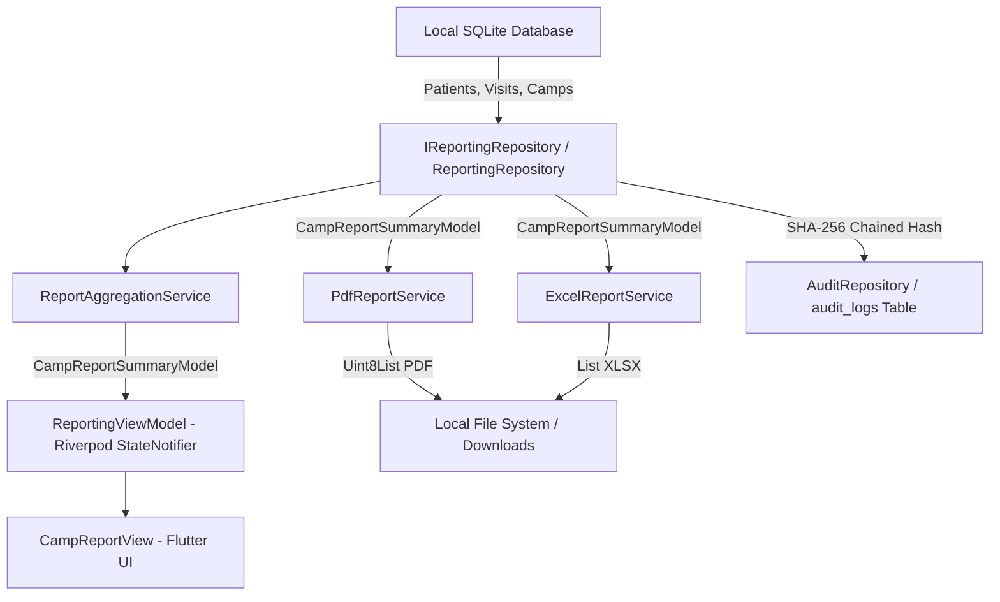

# Gynocamp Patient Registration System
## Technical Specification: Instant Reporting & Epidemiological Analytics Engine (Phase 4)

---

### 1. Executive Summary & Objective

In remote gynecological and pelvic organ prolapse (POP) screening camps across Nepal's mountainous and rural districts, medical officers, NGOs, and municipal health directorates require rapid, authoritative camp summaries immediately upon conclusion of the camp. Previously, aggregating paper Yellow Forms took days or weeks of manual transcription, delaying surgical logistics, referral coordination, and epidemiological reporting.

Phase 4 of the Gynocamp platform introduces an **Instant Reporting & Epidemiological Analytics Engine**. Operating 100% offline from the device's local SQLite database, the engine aggregates patient intake, POP staging, clinical diagnoses, vitals flags, and pharmacy dispensing in milliseconds. With one tap, users can generate:
1. **Official Multi-Page Vector PDF Camp Summaries** suitable for medical officer signatures, municipality submission, and hospital referrals.
2. **Multi-Sheet `.xlsx` Spreadsheets** containing executive summaries, complete patient rosters, and cross-tabulated pathology/pharmacy logs.
3. **Cryptographically Audited Export Chains** where every export operation is logged with a SHA-256 chained hash in SQLite.

---

### 2. Architecture & Data Flow

---

### 3. Core Components

#### 3.1 Aggregated Data Model (`CampReportSummaryModel`)
Encapsulates all statistical dimensions required for clinical evaluation and health directorate reporting:
- **Demographics:** Age group distribution (`<20`, `20-35`, `36-50`, `51-65`, `>65`), marital status, ward breakdown.
- **Pelvic Organ Prolapse (POP) Staging:**
  - Anterior Compartment (Cystocele): Stages 0 to 3.
  - Middle Compartment (Uterine/Apex): Stages 0 to 4.
  - Posterior Compartment (Rectocele): Stages 0 to 3.
  - Highest POP Stage (Baden-Walker / POP-Q composite): Stages 0 to 4.
  - Clinically Significant Prolapse tally and prevalence percentage ($\text{Stage} \ge 2$).
- **Pathology & Clinical Diagnoses:** Ranked frequency of 21 gynecological diagnoses (e.g., PID, Cervicitis, Cervical Erosion, Vaginitis).
- **Point-of-Care Vitals Alerts:** Counts for Hypertension ($\text{Systolic} \ge 140$ or $\text{Diastolic} \ge 90\text{ mmHg}$), Hyperglycemia ($\text{RBS} \ge 140\text{ mg/dL}$), Urine dipstick positives, and pregnancy test positives.
- **Interventions & Referrals:** Pessaries inserted (tallied by type and size), pelvic floor muscle counseling, surgical referrals (tallied by referral hospital).
- **Outpatient Pharmacy:** Dispensed medicine itemization and prescription count.
- **Micro-Data:** Full list of patient and clinical visit objects for granular spreadsheet generation.

#### 3.2 Statistical Engine (`ReportAggregationService`)
A pure Dart aggregation engine with zero external dependencies. It computes exact frequency counts and percentages with guard clauses against division by zero:
- `aggregate({required CampModel camp, required List<PatientModel> patients, required List<ClinicalVisitModel> visits, required String generatedBy})`
- Calculates age distributions from patient chronological ages.
- Determines composite highest POP stage per patient and evaluates camp-wide prolapse burden.

#### 3.3 Vector PDF Generator (`PdfReportService`)
Constructed using `package:pdf/widgets.dart` to produce high-resolution, print-ready documents formatted for standard A4 pages:
- **Camp Identification Header:** Camp name, unique camp code, district, municipality, venue, operational dates, and timestamp.
- **Executive KPI Cards:** Total patients registered, clinical examinations conducted, significant prolapse prevalence rate, and surgical referral totals.
- **Demographic Breakdown:** Dual tables for age distribution and marital status.
- **POP Staging Matrix:** Baden-Walker / POP-Q compartment grid highlighting Stage 0 through Stage 4 cases.
- **Pathology & Pharmacy Section:** Top diagnoses, point-of-care alerts, pessary fittings, and top dispensed medications.
- **Medical Officer Sign-off Block:** Audit metadata, SHA-256 validation marker, and signature line for the Lead Gynecologist.

#### 3.4 Multi-Sheet Spreadsheet Engine (`ExcelReportService`)
Built on `package:excel/excel.dart`, generating `.xlsx` workbooks containing 3 specialized worksheets:
1. **`Camp_Summary`:** Metadata, executive metrics, age distribution, POP frequency, and top diagnoses.
2. **`Patient_Register`:** Exhaustive patient-level log containing Patient ID, Name, Age, Ward, Mobile, Intake Date, Highest POP Stage, Diagnoses, Pessary, and Referral Destination.
3. **`Pathology_Prescriptions`:** Individual prescription records detailing Patient ID, Date, Dispensed Medicine, and Prescribed Quantities.

#### 3.5 Repository & Audit Integration (`ReportingRepository`)
- Queries SQLite `patients`, `clinical_visits`, and `camps` tables.
- Invokes aggregation, PDF generation, or Excel generation.
- Saves binary output files to the device download directory (`path_provider`).
- Automatically logs cryptographic audit entries in `audit_logs` using `AppConstants.auditActionReportPdfExport` and `AppConstants.auditActionReportExcelExport`.

#### 3.6 Presentation Layer (`CampReportView` & `ReportingViewModel`)
- **State Management:** Riverpod `StateNotifierProvider<ReportingViewModel, ReportingState>`.
- **Interactive UI:**
  - Camp selector dropdown (filter by individual camp or aggregate across all camps).
  - 4 Executive KPI metric cards with thematic status colors.
  - 4 Tabbed Clinical Explorers: Demographics, POP Staging, Diagnoses, Treatment & Pharmacy.
  - One-tap quick export action buttons for PDF and Excel with animated progress and file path feedback banners.

---

### 4. Verification & Testing Matrix

The Phase 4 engine is covered by 20 unit, integration, and widget tests:

| Test File | Test Cases | Scope |
| :--- | :---: | :--- |
| `report_aggregation_service_test.dart` | 3 | Demographics, POP matrices, significant rates, diagnoses, alerts |
| `pdf_report_service_test.dart` | 2 | Vector PDF bytes generation, `%PDF-` magic header, empty edge cases |
| `excel_report_service_test.dart` | 2 | Multi-sheet `.xlsx` structure, sheet presence, empty edge cases |
| `reporting_repository_test.dart` | 4 | SQLite aggregation, binary generation, disk write, SHA-256 audit log |
| `reporting_viewmodel_test.dart` | 6 | Riverpod state transitions, PDF/Excel export orchestration, error handling |
| `camp_report_view_test.dart` | 3 | KPI cards rendering, tab transitions, PDF export button action |
| **Total Phase 4 Tests** | **20** | **100% Pass Rate** |

All tests pass in conjunction with Phases 1–3, bringing the total suite to **110/110 passing tests** with 0 warnings on `flutter analyze`.
