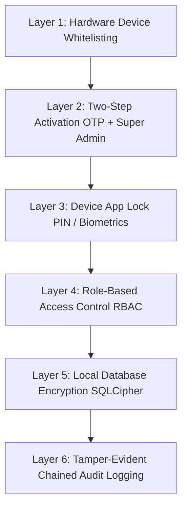
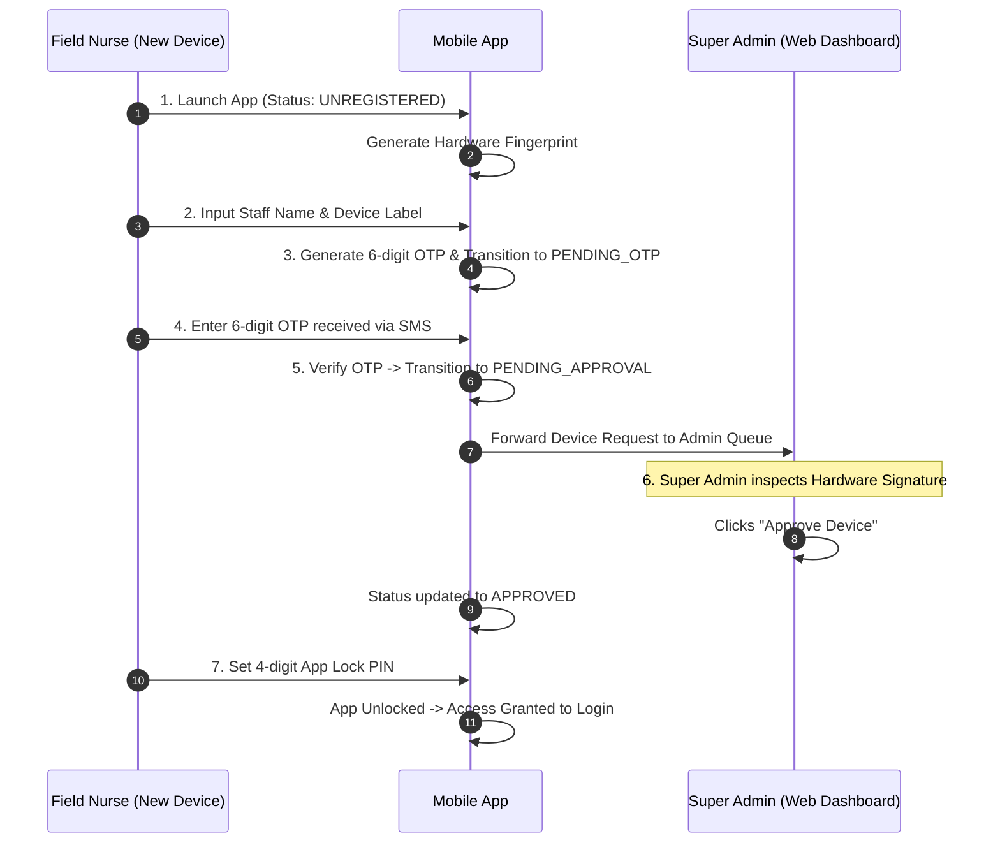

# Security, Device Whitelisting & Activity Audit Specification
## Gynocamp Protection & Compliance Architecture

---

## 1. Threat Model & Field Vulnerabilities

In remote health camps across rural Nepal, mobile tablets are used in public community centers, tents, and schools. Key security threats include:
1. **Unattended Device Tampering:** Staff step away from their desk, leaving a tablet open with sensitive reproductive health data.
2. **Unauthorized Device Access:** A staff member installs the APK on a personal, unvetted phone.
3. **Audit Repudiation:** Accidental or intentional alteration of patient data without accountability.
4. **Data Loss During Remote Outages:** Loss of records due to network failures or device battery death.

---

## 2. Multi-Layered Security Framework



---

## 3. Hardware Fingerprinting & Activation Protocol

### Step 1: Hardware Signature Generation
Each device generates a deterministic 32-character SHA-256 signature combining:
- Device Brand & Model
- Hardware Board Serial & Android ID
- Unique Application Keystore salt

### Step 2: Two-Step Activation Lifecycle



---

## 4. Device App Lock (PIN & Biometrics)

- **PIN Security:** When a device is approved, the field staff creates a 4-to-6 digit numeric PIN.
- **Salted Hashing:** The PIN is never stored in plain text. It is salted and hashed with SHA-256 (`SHA256(salt + PIN + salt)`).
- **Auto-Lock Timeout:** If the app enters the background or remains idle for 5 minutes, it returns immediately to `AppLockPinView`.
- **Biometric Prompt:** Devices equipped with fingerprint sensors allow instantaneous local biometric unlocking mapped to the secure PIN.

---

## 5. Tamper-Evident User Activity Log (Audit Trail)

Every operation within the application generates an immutable audit record:

```json
{
  "id": "log-7b6a12df-4c3e",
  "userId": "usr-datataker-01",
  "userName": "Sita Sharma (Field Nurse)",
  "userRole": "DATA_TAKER",
  "action": "PATIENT_REGISTERED",
  "entityType": "Patient",
  "entityId": "GC-KTM01-2026-00042",
  "detailsJson": "{\"patientId\":\"GC-KTM01-2026-00042\",\"campCode\":\"KTM01\",\"age\":32,\"ward\":\"03\"}",
  "deviceId": "dev-tab-01",
  "timestamp": "2026-09-06T11:45:00.000Z",
  "logHash": "9f83c18b6e2d... (SHA-256 Chained Hash)"
}
```

### Cryptographic Hash Chaining
Each log record's `logHash` is computed as:
$$\text{Hash}_n = \text{SHA256}(\text{LogID} \parallel \text{UserID} \parallel \text{Action} \parallel \text{Timestamp} \parallel \text{Details} \parallel \text{Hash}_{n-1})$$

Any manual alteration of a previous row invalidates the entire subsequent chain, alerting administrators to database tampering.
